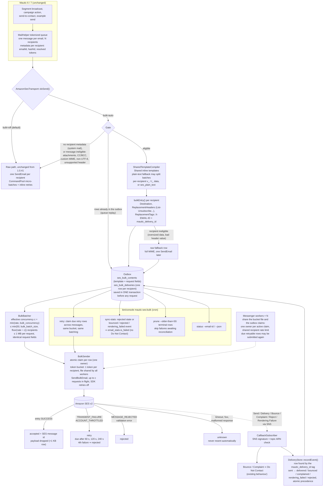
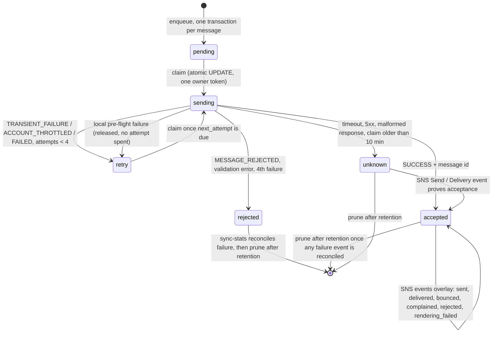

# How `bulk=auto` sends a newsletter

Two diagrams: the path of one Mautic email from the queue to SES and back, and the life of one recipient row in the outbox. GitHub renders them inline.

## End-to-end flow

## Life of one recipient row

Rules the diagrams encode: `bulk=off` never touches the outbox; every SES submission charges the shared token bucket per recipient; a raw fallback is decided before anything is submitted; accepted, unknown and currently sending rows are skipped on replay while retained; a queue replay is answered from the outbox, not from the current email definition. Claims prevent concurrent submission of the same row; due pending/retry rows can be submitted, and pruning ends replay protection for deleted rows.
